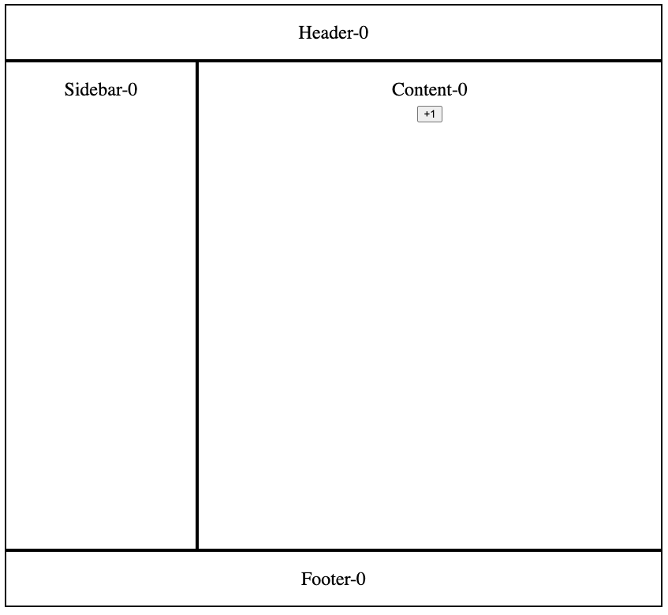
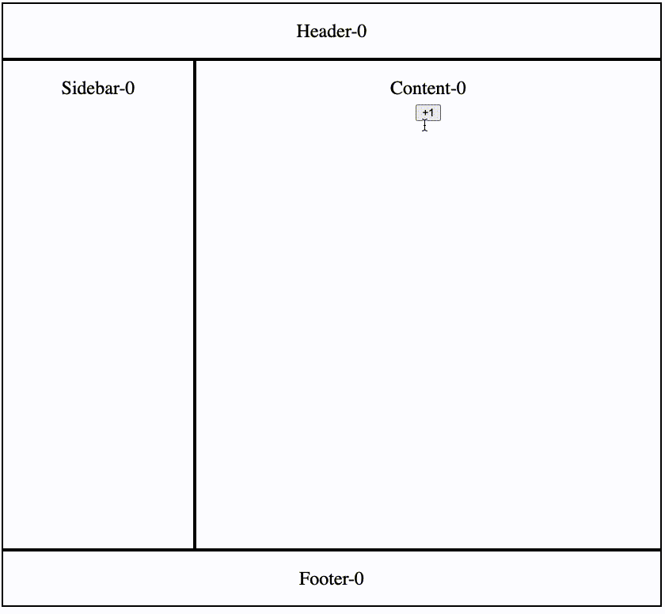
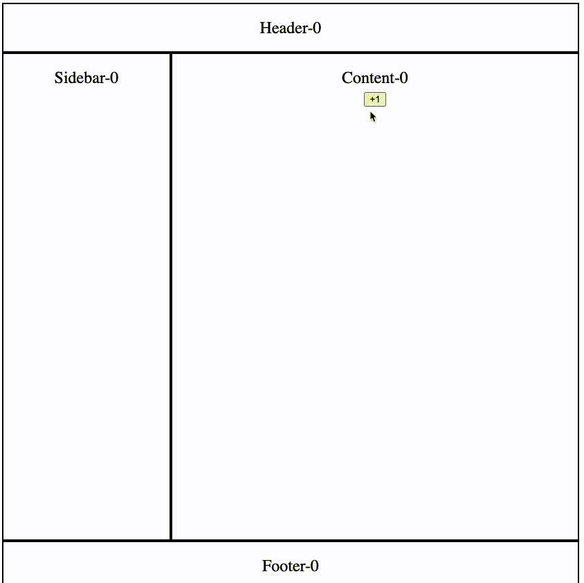

# jotai-scheduler

<p>
  <a href="https://github.com/jotaijs/jotai-scheduler/blob/main/.github/workflows/test.yml"></a>
  <a href= "https://github.com/prettier/prettier"></a>
  <a href="https://github.com/facebook/jest"></a>
  <a href="CONTRIBUTING.md#pull-requests"></a>
  <a href="#license"></a>
</p>

A Jōtai utility package for better performance.

## Install

```
# npm
npm i jotai-scheduler

# yarn
yarn add jotai-scheduler

# pnpm
pnpm add jotai-scheduler
```

## Usage

The usage of jotai-scheduler is very similar to jotai itself. The only difference from the native Jotai API is that it requires passing a priority parameter:

- jotai

  ```
  import { useAtomValue } from 'jotai-scheduler'

  const num = useAtomValue(anAtom, {});
  ```

- jotai-scheduler

  ```
  import { LOW_PRIORITY, useAtomValueWithSchedule } from 'jotai-scheduler'

  const num = useAtomValueWithSchedule(anAtom, {
    priority: LOW_PRIORITY,
  });
  ```

The field `priority` can be can be `IMMEDIATE_PRIORITY`, `NORMAL_PRIORITY`, or `LOW_PRIORITY`. If you don't pass any priority, it will use `NORMAL_PRIORITY` by default, and its behavior is the same as jotai.

Now you can use jotai-scheduler to replace jotai in your project.

- `useAtom` --> `useAtomWithSchedule`
- `useAtomValue` --> `useAtomValueWithSchedule`
- `useSetAtom` --> `useSetAtomWithSchedule`

## Why we need jotai-scheduler?

> You can view a detailed comparison and live demo on [CodeSandbox](https://codesandbox.io/p/sandbox/jotai-scheduler-6ryg9z).

Let's say we have an app that contains typical elements such as the Header, Footer, Sidebar, and Content:

<div align="center">
  
</div>

Every element represents a component, and all these components share the same state. When we click the button, the state will be updated, and all components will be re-rendered. While we were using jotai, the code might have looked like this:

```
const anAtom = atom(0);

const Header = () => {
  const num = useAtomValue(anAtom);
  return <div className="header">Header-{num}</div>;
};

const Footer = () => {
  const num = useAtomValue(anAtom);
  return <div className="footer">Footer-{num}</div>;
};

const Sidebar = () => {
  const num = useAtomValue(anAtom);
  return <div className="sidebar">Sidebar-{num}</div>;
};

const Content = () => {
  const [num, setNum] = useAtom(anAtom);
  return (
    <div className="content">
      <div>Content-{num}</div>
      <button onClick={() => setNum((num) => ++num)}>+1</button>
    </div>
  );
};
```

<div align="center">
  
</div>

When we click the button, the rendering seems a bit laggy, right? That's because we need to wait for all the components to render. But not all components have the same priority. A better way is to render the important content first, and then the rest, the more important content will be shown more quickly.

Let's say the priority of those components is Content > Sidebar > Header = Footer, then we can pass a `priority` field to represent the priority of each component.

Now let's use jotai-scheduler to optimize it:

```
const anAtom = atom(0);

const Header = () => {
  const num = useAtomValueWithSchedule(anAtom, {
    priority: LowPriority,
  });
  return <div className="header">Header-{num}</div>;
};

const Footer = () => {
  const num = useAtomValueWithSchedule(anAtom, {
    priority: LowPriority,
  });
  return <div className="footer">Footer-{num}</div>;
};

const Sidebar = () => {
  const num = useAtomValueWithSchedule(anAtom);
  return <div className="sidebar">Sidebar-{num}</div>;
};

const Content = () => {
  const [num, setNum] = useAtomWithSchedule(anAtom, {
    priority: ImmediatePriority,
  });
  return (
    <div className="content">
      <div>Content-{num}</div>
      <button onClick={() => setNum((num) => ++num)}>+1</button>
    </div>
  );
};
```

<div align="center">
  
</div>

The performance is better. Important content will be displayed to users more quickly, thereby providing a better user experience.
